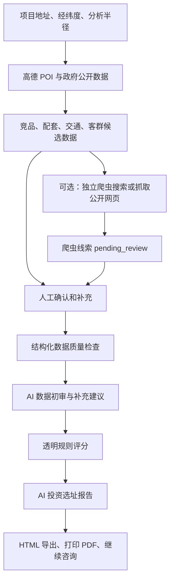

# 电竞馆智能选址系统项目介绍与使用指南

## 一、项目是什么

电竞馆智能选址系统是一套面向电竞馆投资人、运营人员和选址顾问的 Web 分析平台。

用户选定一个地址和分析半径后，系统围绕交通、客群、竞品、夜间消费、周边配套、租金、物业条件和数据质量等维度，完成数据采集、公开网页线索补充、人工确认、数据核验、透明评分和 AI 报告生成。

系统的目标不是代替实地调查，也不是自动承诺项目盈利，而是把分散的选址信息整理成一套可核验、可补充、可追溯的决策材料，帮助投资人更快发现机会、风险和下一步调查重点。

## 二、项目能解决什么问题

传统电竞馆选址通常存在以下问题：

- 只凭感觉判断商圈，人流、竞品和租金信息没有统一口径。
- 高德 POI 能发现商户，却不能证明商户真实经营状态。
- 竞品价格、机器配置、上座率、营业时间等数据散落在网页或线下调查中。
- 餐饮、娱乐和便利店数量不等于真实夜间消费能力。
- 租金样本不足时，容易直接套用不可靠的“城市均价”。
- 数据不完整时直接生成报告，容易出现没有数据却得出确定结论的问题。
- 多个调查人员收集的数据缺少统一记录、确认和追溯机制。

本系统通过“机器采集候选数据 + AI 初审 + 人工确认 + 透明规则评分”的方式解决这些问题。

## 三、核心作用

### 1. 建立项目数据底座

以项目地址、经纬度和分析半径为中心，采集地铁、公交、停车、学校、住宅、竞品、餐饮和娱乐等高德 POI。

### 2. 补充公开网页线索

可选的独立爬虫服务可以根据高德候选对象的名称和地址搜索公开网页，也可以由用户直接提供 URL，尝试补充竞品经营、配套营业和租金信息。

爬虫结果只是线索，默认进入 `pending_review`，不能直接当作已确认事实。

### 3. 统一人工调查

人工补充页面按竞品、周边配套、租金、人口代理指标和物业条件分类展示已有数据。调查人员在已有名称、地址和距离基础上补充真实经营信息，不需要从空白表单重新录入对象。

### 4. 自动检查数据完整度

系统先进行结构化数据质量检查，再由 AI 根据项目目的给出初审结论，明确：

- 已经有哪些数据；
- 哪些数据已确认；
- 哪些只是候选或爬虫线索；
- 缺少哪些关键数据；
- 建议下一步人工调查什么。

### 5. 透明评分

评分引擎按公开规则计算各维度得分、风险、缺失项和置信度。评分与 AI 报告分离，AI 不负责偷偷修改评分规则。

### 6. 生成投资人可读报告

DeepSeek 根据项目结构化数据、评分结果、数据质量、城市洞察和已确认记忆生成 Markdown 报告。报告支持 HTML 导出和浏览器打印为 PDF。

## 四、系统工作原理



### 数据分层原则

| 数据类型 | 系统中的含义 | 能否直接作为正式事实 |
| --- | --- | --- |
| 高德 POI | 发现的候选地点、商户和配套 | 否，需要确认经营真实性 |
| 政府公开数据 | 城市或区县宏观背景 | 可以，但必须注明年份、来源和空间口径 |
| 爬虫数据 | 公开网页中抽取的线索 | 否，默认待人工确认 |
| 人工确认数据 | 调查人员确认或填写的项目事实 | 可以 |
| 演示模拟数据 | 为快速演示流程生成的示例 | 否，不代表真实调查 |
| rejected 数据 | 已人工排除的数据 | 不参与有效统计、评分和报告事实 |

### 真实性边界

- 城市人口不能描述成项目周边 1 公里真实人口。
- 没有真实 LBS 数据时，不能推测小时客流、工作人口或消费转化率。
- 便利店不能自动等同于 24 小时营业。
- 餐饮不能自动等同于夜宵。
- 竞品名称和距离不能自动推导价格、配置、上座率或营业额。
- 租金不能直接推导营业收入或盈利能力。
- AI 不得把推测内容自动写入长期记忆。

## 五、系统分析哪些维度

当前默认维度包括：

| 维度 | 主要关注内容 | 主要数据来源 |
| --- | --- | --- |
| 红线合规 | 学校、幼儿园、政府机构等硬性风险 | 高德、人工核实 |
| 交通可达 | 地铁、公交、停车条件 | 高德 |
| 交通阻隔 | 高架、铁路、立交、绿化隔离等 | 高德、人工调查 |
| 客群人口 | 大学、高职、技校、公寓、年轻住宅等代理指标 | 高德、人工、第三方 |
| 竞品环境 | 竞品数量、距离、确认状态 | 高德、人工 |
| 竞品经营 | 价格、机器数量、配置、上座率、营业时间 | 人工、已确认爬虫数据 |
| 夜间消费 | 夜间餐饮、便利店、夜间经营情况 | 高德、人工 |
| 娱乐配套 | KTV、酒吧、台球、密室、电影院等 | 高德、人工 |
| 餐饮配套 | 餐厅、小吃、烧烤、夜间餐饮 | 高德、人工 |
| 租金成本 | 面积、月租、单价、物业费、转让费 | 人工、已确认爬虫数据 |
| 物业条件 | 面积、供电、消防、网络、门头、停车、楼层 | 人工调查 |
| 市场容量 | 区域消费容量和目标客群空间 | 人工、第三方数据 |
| 数据质量 | 数据完整度、来源和人工确认状态 | 系统检查 |

管理员可以在配置页面新增或调整维度、名称、说明、权重、启用状态和依赖数据源。各启用维度的权重应保持合理并规范化。

## 六、完整工作流程

### Step 1：新建或选择项目

填写：

- 项目名称；
- 城市和区县；
- 详细地址；
- 业务类型，例如电竞馆；
- 分析半径，例如 1000 米；
- 预计面积，单位为平方米；
- 投资预算，单位为万元。

创建后，项目会出现在左侧项目列表。后续数据、评分和报告都绑定到该项目。

### Step 2：确认地址和范围

检查系统识别的：

- 地址是否准确；
- 城市和区县是否正确；
- 经纬度是否存在；
- 分析半径是否符合本次选址目的。

如果项目缺少经纬度，高德采集会失败，因此必须先修正地址或完成地理编码。

### Step 3：采集基础数据

建议按以下顺序执行：

1. 点击“采集高德 POI”；
2. 点击“获取竞品”；
3. 点击“获取配套”；
4. 点击“获取城市公开数据”。

执行后可以看到：

- POI 数量；
- 疑似竞品数量；
- 餐饮数量；
- 娱乐数量；
- 夜间商业候选数量；
- 城市或区县公开统计数据及年份。

这里的竞品、餐饮和娱乐仍是“发现结果”，不是已确认经营事实。

### Step 4：搜索并补充公开数据（可选）

如果服务器已经单独安装并启用爬虫 Worker，可以：

- 搜索并补充竞品信息；
- 搜索并补充周边配套；
- 搜索并补充租金信息；
- 手动添加公开网页 URL 进行抓取。

自动流程为：

```text
高德名称和地址
→ 生成搜索关键词
→ 搜索候选网页
→ 相关性检查
→ 抓取公开内容
→ 字段抽取与合理范围校验
→ 保存为待确认线索
```

如果搜索引擎返回不相关页面，系统应跳过，不能把城市百科中的数字误写为竞品面积或租金。公开网站限制访问时，系统只记录失败，不绕过登录、验证码、付费墙或反爬机制。

### Step 5：人工确认和补充

这是正式分析中最关键的一步。

人工需要确认：

- 疑似竞品是否真的是电竞馆或网咖；
- 配套商户是否真实存在、是否正常经营；
- 爬虫来源是否与目标商户匹配；
- 租金记录是否与项目区域和物业类型相关。

并建议补充：

- 竞品：价格、会员价、机器数量、CPU、GPU、显示器、营业时间、上座率、充值活动；
- 配套：营业时间、是否夜间营业、是否 24 小时；
- 租金：地址、面积、月租、物业费、转让费、来源和发布日期；
- 物业：供电、网络、消防、楼层、门头、停车、整改要求；
- 客群：大学、公寓、年轻住宅、夜间年轻人流等实地观察。

状态含义：

- `pending_review`：待确认；
- `confirmed`：已确认，可以进入正式分析；
- `rejected`：已排除，不进入有效统计。

如果只做产品演示，可以点击“一键填充模拟数据”快速跑通流程，但必须明确这些数据不代表真实调查，不能用于投资决策。

### Step 6：AI 数据核验

点击“AI 数据核验”后，系统执行两层检查：

1. 结构化规则检查：统计缺失字段、待确认数据、失败任务和详情完整度；
2. AI 初审：根据电竞馆选址目标，解释缺失数据会影响什么，并给出人工补充建议。

这一阶段的正确使用方式是：

```text
第一次核验
→ 查看缺失项
→ 返回人工补充
→ 再次核验
→ 数据达到可接受程度后继续评分
```

AI 只负责初审和建议，最终真实性仍由人工负责。

### Step 7：评分分析

点击“开始评分分析”，系统按照已配置的透明规则计算：

- 综合评分和评级；
- 各维度得分；
- 主要加分原因；
- 风险项；
- 缺失项；
- 数据置信度；
- 竞品分析、夜间消费分析和租金压力分析。

硬性风险与普通得分分开显示，高分不能掩盖消防、合规、供电或物业等红线风险。

### Step 8：生成报告和继续咨询

建议在完成数据核验和评分后，再点击“生成 AI 报告”。

报告主要包含：

1. 综合结论与建议动作；
2. 评分总览与红线风险；
3. 城市与区域宏观背景；
4. 项目商圈微观环境；
5. 交通与可达性；
6. 客群人口分析；
7. 竞品分析；
8. 夜间消费和配套分析；
9. 租金成本与物业条件；
10. 数据缺口和人工核实清单；
11. 投资建议；
12. 数据来源、统计年份和空间口径。

生成后可以：

- 在页面查看 Markdown 报告；
- 导出 HTML；
- 使用浏览器打印为 PDF；
- 围绕当前项目继续向 AI 提问。

## 七、选定一个地址后，具体应该怎么做

以“小寨地铁站、1000 米、电竞馆”为例：

```text
1. 新建项目
   项目名称：小寨地铁站电竞馆选址
   城市：西安市
   区县：雁塔区
   地址：小寨地铁站
   半径：1000 米
   预计面积：500 平方米
   投资预算：150 万元

2. 检查地图位置和经纬度
   确认定位确实在小寨地铁站附近。

3. 采集高德 POI
   获取交通、学校、住宅、餐饮、娱乐等基础数据。

4. 获取竞品和配套
   建立疑似竞品、餐饮、娱乐和夜间商业候选列表。

5. 获取城市公开数据
   补充西安市或雁塔区人口、经济、消费等宏观背景。

6. 可选执行爬虫
   根据候选名称和地址搜索公开网页，或手动提供可信 URL。

7. 人工确认
   排除电玩店、电竞酒店等误判对象；确认真正电竞馆和有效配套。

8. 人工补充关键数据
   优先填写竞品价格、机器数量、显卡、上座率、营业时间、真实租金和物业条件。

9. 执行 AI 数据核验
   根据缺失清单继续补充，直到关键项基本完整。

10. 执行评分
    查看综合评分、各维度得分、风险和置信度。

11. 生成 AI 报告
    检查报告中的每个数字是否能追溯到数据来源。

12. 导出报告并安排线下复核
    根据人工核实清单实地确认消防、供电、网络、租金和竞品经营状态。
```

## 八、两种推荐使用方式

### 演示模式

适合产品演示或培训：

```text
创建项目 → 高德采集 → 一键填充模拟数据 → 数据核验 → 评分 → 报告
```

优点是速度快，几分钟可以展示完整闭环；限制是模拟数据不能用于真实投资决策。

### 正式选址模式

适合真实投资项目：

```text
创建项目
→ 高德和政府数据采集
→ 可选公开网页线索补充
→ 人工逐条确认
→ 实地补充竞品、租金和物业数据
→ 两次以上数据核验
→ 评分
→ 报告
→ 线下终审
```

正式模式的重点不是“尽快生成报告”，而是确保关键数据有来源、已确认并能追溯。

## 九、配置页面怎么使用

首次部署后由管理员完成一次配置，普通用户即可直接使用工作台：

- DeepSeek API Key、API 地址和模型；
- 高德 Web Service Key；
- 高德 JS Key 和安全密钥；
- 爬虫启用状态、搜索 Provider、超时和域名限制；
- 政府公开数据开关；
- 评分维度、子因素、权重和数据源；
- Memory 查看、确认和停用。

Key 加密存入数据库，页面只显示脱敏状态，不回显完整 Key。数据库配置优先于 `.env`，数据库没有配置时继续使用 `.env` 作为备用。

## 十、Memory 的作用

Memory 用来保存能够长期复用、且经过确认的业务经验，不用来保存 AI 的随意推测。

可保存：

- 用户偏好，例如常用城市、业态和报告风格；
- 项目备注和历史调查结论；
- 电竞馆选址业务规则；
- 真实经营结果和成功、失败原因；
- 数据源适用范围和使用经验。

自动生成的 Memory 默认待确认。只有确认后的 Memory 才能参与后续项目分析和 AI 报告，并应标注来自用户经验、历史案例、本项目人工补充或系统规则。

## 十一、当前能力边界

- 系统可以采集高德 POI，但 POI 只表示发现，不代表经营有效。
- 独立爬虫可以搜索和抓取公开网页，但受搜索质量、网站限制和页面变化影响，不能保证每个对象都有结果。
- 爬虫必须进行目标相关性和数值合理性校验，且结果仍需人工确认。
- 政府公开数据提供城市或区县宏观背景，不代表项目 1 公里商圈真实客流。
- 当前没有商业 LBS 小时客流、真实工作人口和消费热力数据时，报告必须明确说明未接入。
- 系统不预测营业额，不承诺盈利，不替代消防、合规、租约和物业尽调。

## 十二、最终决策建议

系统输出应作为“选址初筛和尽调导航”，而不是唯一投资依据。

建议最终决策至少同时满足：

1. 未发现不可接受的硬性红线；
2. 关键竞品经营数据已经人工确认；
3. 租金、面积和物业条件有真实来源；
4. 夜间经营和目标客群经过实地观察；
5. 数据质量达到可接受水平；
6. 评分原因与业务经验一致；
7. AI 报告中的数字可以追溯；
8. 投资人完成线下复核和财务测算。
